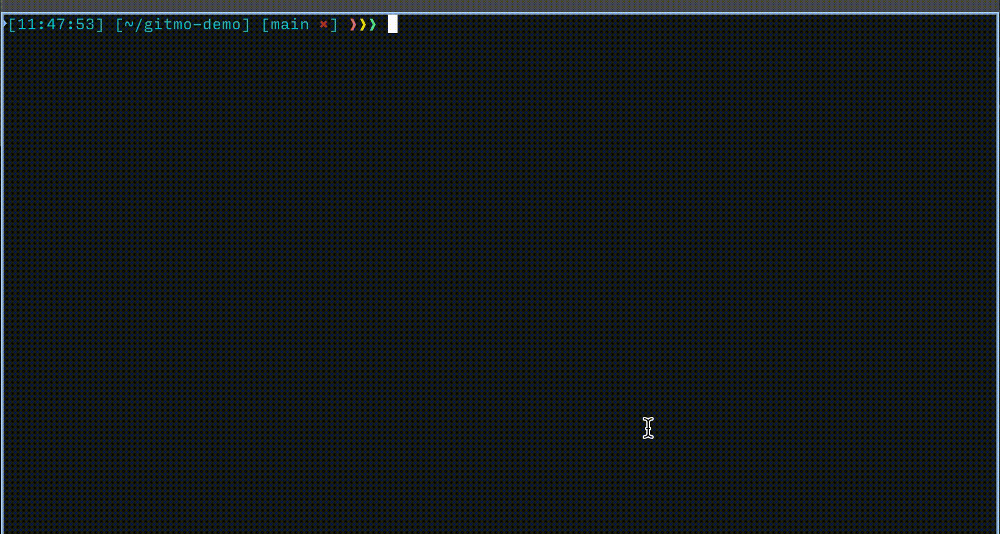

# gitmo

> A cli tool that adds appropriate emoji to your commit messages based on conventional commits specification

<!-- [[!demo.mov](demo.mov)] -->

[](./demo.gif)

## About

This cli was built as a simpler alternative to [gitmoji-cli](https://github.com/carloscuesta/gitmoji-cli). There is no step to pick an emoji, we simply determine the appropriate emoji to use based on your commit message and include it in your message

## Install

### npm

```bash
npm i -g gitmo
```

## Usage

```bash
gitmo --help
```

```
  A cli tool that adds appropriate emoji
  to your commit message based on conventional commits specification

  Usage
    $ gitmo [option] [command]
  Options
    --commit, -c     Add commit using the gitmo
    --version, -v    Print current installed version
    --update, -u     Update gitmo cli
  Examples
    $ gitmo -c
```

## Commit types

```
| Commit Type | Title                    | Description                                                                                                 | Emoji |
| ----------- | ------------------------ | ----------------------------------------------------------------------------------------------------------- | :---: |
| `feat`      | Features                 | A new feature                                                                                               |  ✨   |
| `fix`       | Bug Fixes                | A bug Fix                                                                                                   |   🐛   |
| `docs`      | Documentation            | Documentation only changes                                                                                  |  📚   |
| `style`     | Styles                   | Changes that do not affect the meaning of the code (white-space, formatting, missing semi-colons, etc)      |  💄   |
| `refactor`  | Code Refactoring         | A code change that neither fixes a bug nor adds a feature                                                   |  📦   |
| `perf`      | Performance Improvements | A code change that improves performance                                                                     |  🚀   |
| `test`      | Tests                    | Adding missing tests or correcting existing tests                                                           |  🚨   |
| `build`     | Builds                   | Changes that affect the build system or external dependencies (example scopes: gulp, broccoli, npm)         |  🛠   |
| `ci`        | Continuous Integrations  | Changes to our CI configuration files and scripts (example scopes: Travis, Circle, BrowserStack, SauceLabs) |   ⚙️   |
| `chore`     | Chores                   | Other changes that don't modify src or test files                                                           |   ♻️   |
| `revert`    | Reverts                  | Reverts a previous commit                                                                                   |   🗑  |
```

## How to commit

```bash
# Note: This should be done after staging your changes
gitmo -c
```

You get this prompt:

```
? commit message › ENTER COMMIT MESSAGE HERE
```

press ENTER

---

## Development

```bash
# Build
bun run build

# Run command
./dist/cli.js gitmo -c
```

---

### Resources used

- [Conventional commit types](https://github.com/pvdlg/conventional-commit-types)
- [gitmoji-cli](https://github.com/carloscuesta/gitmoji-cli)
